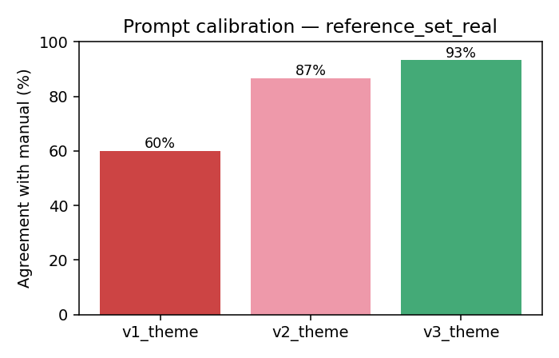

# Prompt-Calibration Harness for Transcript-Based Qualitative Coding

A small, self-contained demonstration of the discipline behind an LLM scoring pipeline:
**a fixed reference set, versioned prompts, and a repeatable test that says — with numbers —
whether a prompt change is an improvement, and flags when a "minor" change quietly moves a
classification.**

The worked example uses my own MSc dissertation data (a mixed-methods study of UK students'
attitudes to AI vs human mental-health support, n≈110), but the harness is domain-agnostic:
swap the reference set and the coding frame and it runs on any transcript-classification task.

> Built as a portfolio piece for the **Deep Signal / The Hacking Games — Research Operations
> Partner** role. It deliberately mirrors that job's core: *rigorous testing, clean
> versioned records, and clear diagnostic evidence for someone else's clinical judgement to
> rely on.* See [`docs/HOW_THIS_MAPS_TO_THE_ROLE.md`](docs/HOW_THIS_MAPS_TO_THE_ROLE.md).

---

## The headline result

Two independent lines of evidence, both fully reproducible from this repo.

### 1. Prompt calibration (the main deliverable)
The same three prompts, coding the same 30-response reference set, scored against a manual
coding frame. Each version bump is a documented hypothesis with a measured outcome:

| Version | What changed | Agreement | Cohen's κ | Macro F1 |
|---------|--------------|-----------|-----------|----------|
| **v1** — zero-shot | theme names only | 60.0% | 0.500 | 0.457 |
| **v2** — + definitions | definitions + dominant-theme rule | 86.7% | 0.830 | 0.866 |
| **v3** — + few-shot | tie-break rules + worked examples | 93.3% | 0.916 | 0.796 |



Note the honest wrinkle: v3's **agreement and κ rise** but its **macro-F1 dips** — a single
rare-class error (one ACCURACY response pushed to OTHER) costs more on a macro average than
on overall agreement. That is exactly the kind of "the headline metric improved but a
sub-group got worse" signal a calibration role exists to surface, not bury.

### 2. Convergent validity (the NLP half)
An unsupervised, hypothesis-blind method (VADER sentiment on the free text) independently
reproduces the direction of the dissertation's quantitative finding — humans are rated
warmer than AI on both emotional connection and concerns:

| Comparison | AI | Human | Paired t | p | Cohen's dz |
|------------|----|-------|----------|---|-----------|
| Emotional connection (Q38 vs Q39) | +0.155 | +0.420 | t(109)=5.65 | 1.3e-07 | 0.54 |
| Expectations / concerns (Q40 vs Q41) | +0.072 | +0.291 | t(108)=3.27 | 0.0014 | 0.31 |

The interesting part is the *disagreement in magnitude*: the Likert scales gave effect sizes
of dz ≈ 1.2–2.6, the lexical method gives dz ≈ 0.3–0.5. Same direction, far blunter
instrument — a concrete example of where a computational method under-reads reality. (And
"body language" is a top bigram for human connection that word-level sentiment cannot
represent at all.)

---

## What's in here

```
prompts/            v1/v2/v3 prompt files + CHANGELOG.md (every bump = hypothesis + result)
docs/coding_frame.md  the 6-theme frame, with definitions, markers, and tie-break rules
src/
  prepare_data.py       raw export -> clean, de-identified long-form responses (+ PII screen)
  build_reference_sets.py  builds the coded reference sets (real = git-ignored; demo = committed)
  code_with_llm.py      runs a prompt over responses (Anthropic API, or offline fixtures)
  evaluate.py           agreement, Cohen's κ, per-theme P/R/F1, confusion matrix, flip detector
  marker_importance.py  which lexical markers drive each theme (weighted log-odds + logistic regression)
  nlp_analysis.py       VADER sentiment + frequency + paired convergent-validity tests
  run_experiment.py     orchestrates a run; writes a versioned manifest per (dataset,prompt)
results/
  runs/<dataset>__<version>__<prompthash>/   manifest.json, metrics.json, confusion.csv, disagreements.csv
  summary_*.md, flips_*.csv, figures/*.png, nlp_summary.json, convergent_validity.json
```

Every result is traceable to the exact **model + prompt file (with sha256) + dataset (with
sha256) + git commit** that produced it — see any `results/runs/*/manifest.json`.

---

## Reproduce it

```bash
python3 -m venv .venv && source .venv/bin/activate
pip install -r requirements.txt

# runs with NO API key — model labels come from stored fixtures
python src/build_reference_sets.py
python src/run_experiment.py --demo     # synthetic set, safe to run anywhere
python src/evaluate.py data/reference/reference_set_demo.csv
```

To score **live** against a model instead of the fixtures, set `ANTHROPIC_API_KEY` and
`pip install anthropic`; `run_experiment.py` then sends each response through the prompt
files and records `scoring_mode: api:<model>` in the manifest.

The real-data run (`python src/run_experiment.py`, and `src/nlp_analysis.py`) needs the raw
survey at `data/raw/survey_raw.csv`, which is **git-ignored** — see the governance note below.

---

## Data governance (read this — it's part of the point)

The raw participant free text was collected under GDPR for a specific dissertation with
anonymous reference IDs. Re-using it to build a public portfolio piece is a new purpose, so:

- **No raw participant text is committed.** `data/raw/`, `data/processed/`, and
  `data/reference/reference_set_real.csv` are git-ignored.
- The **public, committed** reference set (`reference_set_demo.csv`) is **synthetic** — short
  responses I wrote to exercise the same themes.
- Only **aggregate, de-identified** outputs are committed (metrics, confusion matrices, word
  frequencies) — never a raw response.
- `prepare_data.py` runs a light PII screen and reports any hits for manual review.

Full reasoning: [`docs/DATA_GOVERNANCE.md`](docs/DATA_GOVERNANCE.md).

---

## Documentation
- [`docs/coding_frame.md`](docs/coding_frame.md) — the coding frame
- [`prompts/CHANGELOG.md`](prompts/CHANGELOG.md) — versioned prompt history
- [`docs/METHOD.md`](docs/METHOD.md) — method in full
- [`docs/DECISIONS.md`](docs/DECISIONS.md) — running decision log
- [`docs/DATA_GOVERNANCE.md`](docs/DATA_GOVERNANCE.md) — purpose-limitation reasoning
- [`docs/HOW_THIS_MAPS_TO_THE_ROLE.md`](docs/HOW_THIS_MAPS_TO_THE_ROLE.md) — JD mapping

*The manual codes here are an illustrative reference standard, not the dissertation's final
Framework Analysis codes. Replacing the `manual_theme` column with those codes is a
one-column edit and re-run.*
